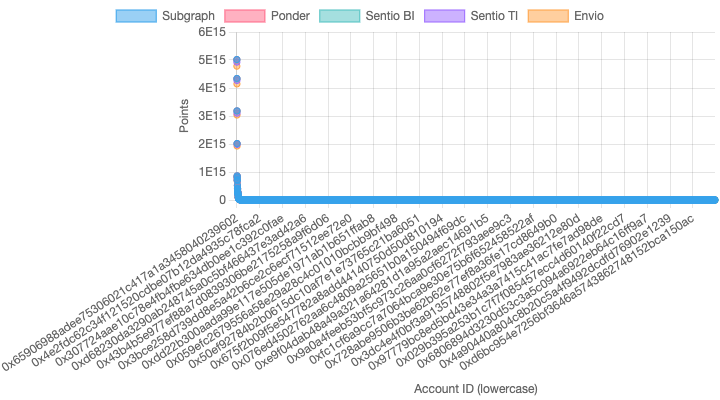

# Case 2: LBTC Full Indexing Benchmark

This benchmark tests the performance of various indexers when processing Transfer events and making RPC calls to fetch token balances from the LBTC token contract.

## Benchmark Specification

- **Target Contract**: LBTC Token (0x8236a87084f8B84306f72007F36F2618A5634494)
- **Events Indexed**: Transfer events
- **Block Range**: 22400000 to 22500000
- **Data Operations**: Read-after-write (fetching balances after processing transfers)
- **RPC Calls**: balanceOf() to fetch token balances for each address involved in transfers
- **Dataset**: [Google Drive](https://drive.google.com/drive/u/0/folders/1YV_xhTYViVaCiqXgEgPDDjoWb9s8QLMZ)

## Implementation Details

The benchmark requires each indexer to:

1. **Event Processing**:
   - Listen for `Transfer(address indexed from, address indexed to, uint256 value)` events
   - Create a record for each Transfer event

2. **Balance Tracking**:
   - Make RPC calls to fetch the current balance of both the sender and receiver
   - Create snapshot records with account balances
   - Update account records with latest balances and timestamps

3. **Points Calculation**:
   - Update points in real-time as new transfers occur
   - Additionally, perform periodic updates using either:
     - Time-based intervals (e.g., hourly updates)
     - Block-based intervals (e.g., every N blocks)
   - Each platform implements its own interval mechanism (see Platform-Specific Implementation Details)

This benchmark tests the ability of indexers to not only process events but also to make external RPC calls and manage more complex data relationships, including real-time and periodic updates.

## Platform-Specific Implementation Details

Each platform handles periodic updates differently:

1. **Points Calculation**
   - All platforms calculate points whenever new transfers occur
   - This ensures real-time point updates for all accounts

2. **Periodic Updates**
   - **Sentio**: 
     - Features both `onTimeInterval` and `onBlockInterval` functionalities (`onTimeInterval` is exclusive to Sentio)
     - Dual-interval system:
       - Historical interval: For speedy catchup of past data
       - Ongoing interval: For prompt updates of new data
     - Example: Daily intervals for history + hourly intervals for ongoing updates

   - **Envio**: 
     - No built-in `onTimeInterval` or `onBlockInterval`
     - Implements global update timestamp in transfer handler
     - Updates on hourly basis within the handler

   - **Ponder**: 
     - Approximates time interval updates using fixed block intervals
     - Relies on block-based handler

   - **Subsquid**: 
     - Block-based starting points for all indexers
     - Implements global updates inside the processing loop
     - Uses fixed time intervals for updates

   - **Subgraph**: 
     - Uses `handleBlock` for periodic updates
     - Configurable block intervals in `subgraph.yaml`
     - Block-based scheduling approach

3. **RPC Batching**
   - **Envio**: Built-in RPC batching through platform infrastructure
   - **Sentio/Ponder/Subsquid**: Use multicall for batch RPC requests
   - **Subgraph**: No native support for RPC batching, each call is made individually

## Performance Results

### Latest Benchmark Results (Block Range: 22400000 - 22500000)

| Indexer | Duration | Records | RPC Time | Compute Time | Storage Time |
|---------|----------|---------|-----------|-------------|--------------|
| Sentio (timeInterval) | 7m | 7,634 | 181.12s | 0.55s | 53666.13s |
| Sentio (blockInterval) | 5m | 7,634 | 149.48s | 0.75s | 55715.68s |
| Ponder | 45m | 7,634 | 2401.97s | 0.26s | 83.49s |
| Envio | 3m | 7,634 | 114132.07s | 10.17s | 260155.37s |
| Sqd | 34m | 7,634 | 1770.73s | 0.88s | 56268.61s |
| Subgraph | 1h3m | 7,634 | - | - | - |
| Sentio Subgraph | 56m | 7,634 | - | - | - |

### Performance Analysis

1. **RPC Performance**:
   - Sentio shows the most efficient RPC handling with both modes under 200s
   - Ponder demonstrates good RPC performance at 2401.97s
   - Sqd maintains moderate RPC time at 1770.73s
   - Envio shows the highest RPC time at 136425.85s
   - Note: Subgraph does not support `performance.now()` or `Date.now()` for time measurement, so detailed timing metrics are not available

2. **Compute Performance**:
   - All platforms show very fast compute times (under 1s) except Envio
   - Envio's compute time (10.17s) is significantly higher, this probably is due to the unique batching optimization
   - Sentio's compute time is consistent between modes (0.55s vs 0.75s)

3. **Storage Performance**:
   - Envio shows the highest storage time (337790.82s)
   - Sentio's storage time is high but consistent between modes (53666.13s vs 55715.68s)
   - Ponder demonstrates excellent storage performance at 83.49s
   - Sqd shows moderate storage time at 56268.61s

### Points Distribution Analysis

   
   - Shows point distribution across all platforms
   - Highlights correlation between platforms
   - Demonstrates consistent ranking patterns

Key findings from the points distribution analysis:

1. **Correlation Analysis**:

   **Pearson Correlation (Linear)**
   | Platform | Subgraph | Ponder | Sentio BI | Sentio TI | Envio |
   |----------|----------|---------|------------|------------|--------|
   | Subgraph | 1.0000   | 1.0000  | 0.9917     | 0.9917     | 0.9917 |
   | Ponder   | 1.0000   | 1.0000  | 0.9917     | 0.9917     | 0.9917 |
   | Sentio BI| 0.9917   | 0.9917  | 1.0000     | 1.0000     | 1.0000 |
   | Sentio TI| 0.9917   | 0.9917  | 1.0000     | 1.0000     | 1.0000 |
   | Envio    | 0.9917   | 0.9917  | 1.0000     | 1.0000     | 1.0000 |

   **Spearman Correlation (Rank)**
   | Platform | Subgraph | Ponder | Sentio BI | Sentio TI | Envio |
   |----------|----------|---------|------------|------------|--------|
   | Subgraph | 1.0000   | 1.0000  | 0.9971     | 0.9971     | 0.9971 |
   | Ponder   | 1.0000   | 1.0000  | 0.9971     | 0.9971     | 0.9971 |
   | Sentio BI| 0.9971   | 0.9971  | 1.0000     | 1.0000     | 1.0000 |
   | Sentio TI| 0.9971   | 0.9971  | 1.0000     | 1.0000     | 1.0000 |
   | Envio    | 0.9971   | 0.9971  | 1.0000     | 1.0000     | 1.0000 |

   - Perfect correlation between Subgraph and Ponder (1.0000)
   - Very high correlation between all other platform pairs
   - Slightly higher rank correlation (Spearman) compared to linear correlation (Pearson)

2. **Distribution Patterns**:
   - All platforms show similar point distribution patterns
   - Top accounts maintain consistent rankings across platforms
   - Minor variations in point values do not affect overall ranking

3. **Data Quality**:
   - All platforms successfully captured the same set of accounts (7,634)
   - Point calculations are consistent across implementations
   - No significant outliers or anomalies in the data

## Implementation Examples

Each subdirectory contains the implementation for a specific indexing platform:
- `/sentio`: Sentio implementation 
- `/envio`: Envio implementation
- `/ponder`: Ponder implementation
- `/sqd`: Subsquid implementation
- `/subgraph`: The Graph subgraph implementation

## Exported Data

All benchmark data has been exported and is available for download:
- **Google Drive**: [Case 2 - LBTC Full Data](https://drive.google.com/drive/folders/1YV_xhTYViVaCiqXgEgPDDjoWb9s8QLMZ)
  - Transfer events from all platforms
  - Account balances and snapshots
  - Points calculation results
  - Performance metrics and timing data
  - Correlation analysis results
  - Visualization data and charts
